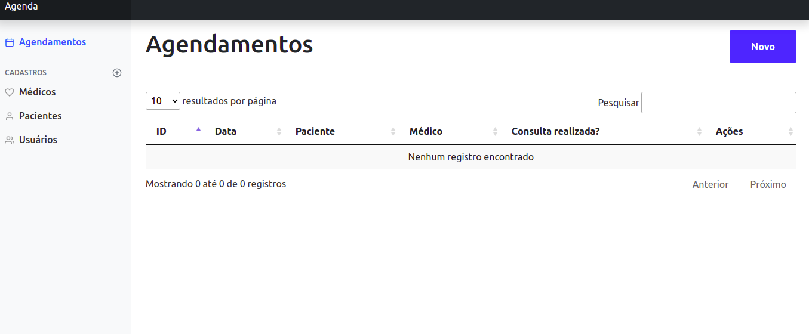
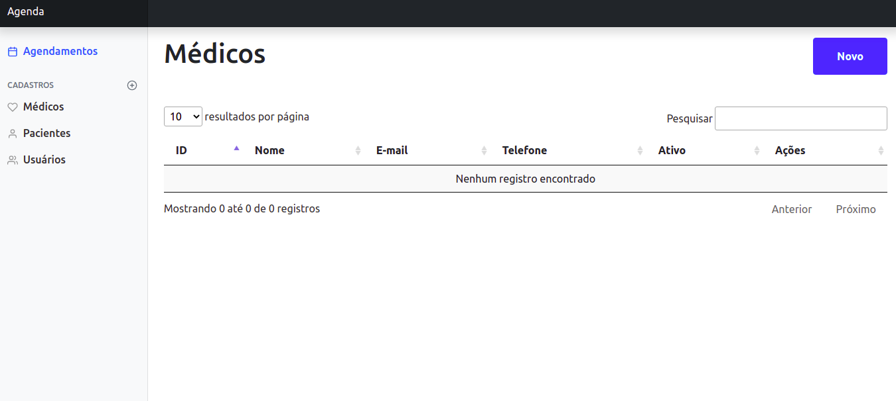
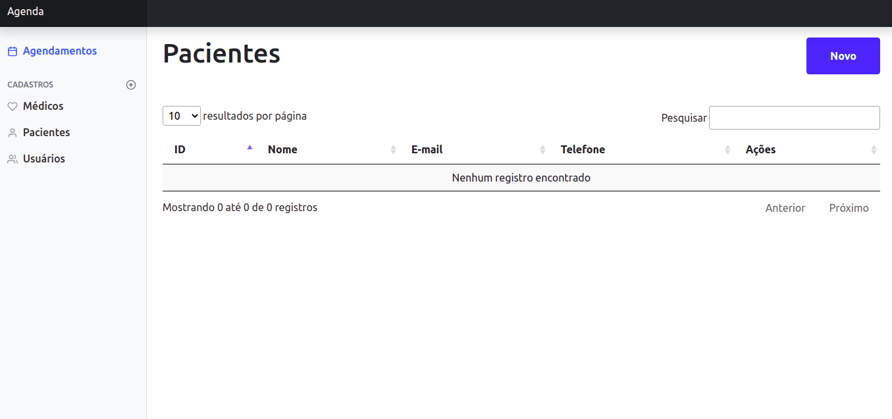
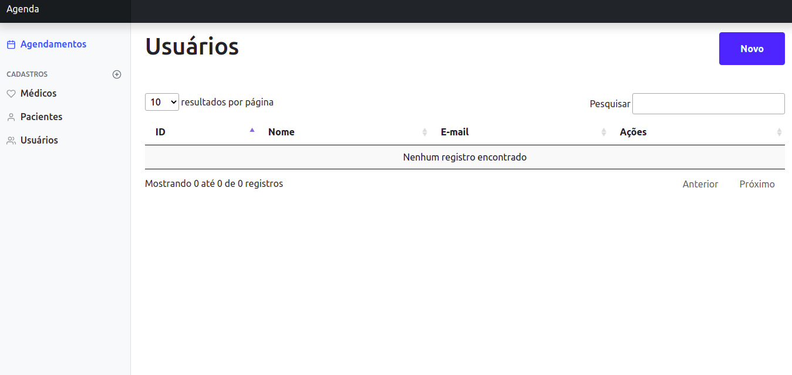

# Introdução

Agenda - Aplicação para cadastro de consultas médicas.

# Pré-requisitos

- Docker
- docker-compose

# Sobre o build

Esta API foi criada com a utilização das seguintes ferramentas:

Backend:

- Laravel
- MySQL

Frontend:

- VueJS
- Vuex
- VueRouter

# Execução

 Para o sistema garanta que o Docker e o docker-compose estejam instalados e rodando na sua máquina. Após essa verificação rodar os seguintes comandos:
 
 - docker-compose up -d
 - docker-compose exec app bash (para entrar no container da aplicação)
 - composer install
 - cp .env.example .env
 - php artisan key:generate
 - npm install ou yarn
 - npm run dev
 
 Após o build da image, os containers estarão prontos e a aplicação estará disponível no endereço: http://localhost.
 
# Screenshots

